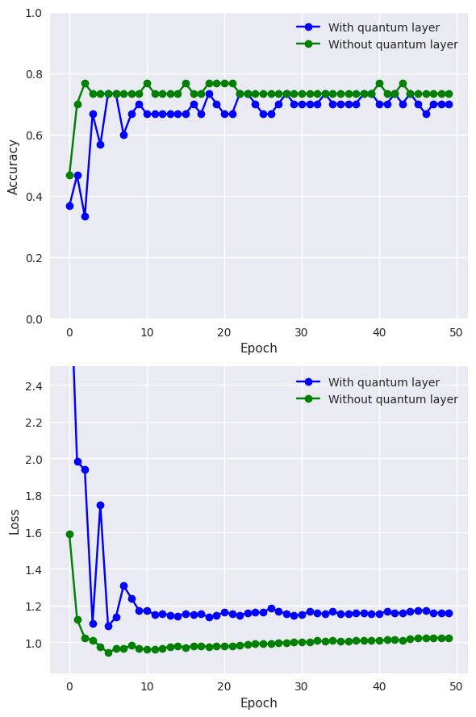

# High-Performance Quanvolutional Neural Networks with JAX & Flax

[](https://github.com/google/jax)
[](https://pennylane.ai/)
[](https://github.com/google/flax)

This repository implements a **Quanvolutional Neural Network (QNN)** using the **JAX** ecosystem. It is a modern, high-performance port of the classic [PennyLane Quanvolution tutorial](https://pennylane.ai/qml/demos/tutorial_quanvolution) (originally implemented in TensorFlow/Keras).

By migrating to JAX, this project leverages **Just-In-Time (JIT) compilation** and **automatic vectorization (`vmap`)** to significantly accelerate the quantum simulation of image patches.

## 🚀 Key Features

  * **Vectorized Quantum Execution:** Replaces slow Python loops with `jax.vmap` to execute the quantum circuit on all image patches simultaneously.
  * **Hybrid Architecture:** Combines a quantum pre-processing layer (PennyLane) with a classical Dense output layer (Flax).
  * **Custom Training Loop:** Implements a fully stateless optimization loop using Optax, offering fine-grained control over the training state.
  * **XLA Optimization:** Utilizes `@jax.jit` to compile training and evaluation steps for maximum throughput.

## 🛠️ Methodology: The "Quanvolution" Layer

In a Quanvolutional Neural Network, a quantum circuit behaves like the convolution kernel.

1.  **Patch Extraction:** The image is divided into small $2\times2$ regions.
2.  **Quantum Encoding:** Pixel data is encoded into quantum rotation gates ($R_y$).
3.  **Processing:** A random quantum circuit processes the qubits.
4.  **Measurement:** The expectation values serve as new features for the classical network.

**The JAX Advantage:**
Standard implementations iterate over these patches sequentially. This project stacks all patches into a single tensor and applies the quantum circuit in one vectorized pass:

```python
# From quanvolution_jax.ipynb
vectorized_circuit = jax.vmap(circuit, in_axes=(0, None))
q_results_list = vectorized_circuit(patch_features, weights)
```

## 📦 Installation

1.  **Clone the repository:**

    ```bash
    git clone https://github.com/your-username/quanvolution-jax.git
    cd quanvolution-jax
    ```

2.  **Install dependencies:**
    It is recommended to use a virtual environment (Python 3.10+).

    ```bash
    pip install -r requirements.txt
    ```

## 💻 Usage

1.  **Run the Notebook:**
    Open `quanvolution_jax.ipynb` in Jupyter Lab or VS Code.

2.  **Workflow:**

      * The notebook will download the MNIST dataset.
      * It will preprocess the images using the quantum circuit (this may take a moment, but is accelerated via JAX).
      * Two models will be trained: one using Quantum features, and one using Classical features.

## 📊 Results

Below is the comparison between the Quantum-enhanced model and the standard Classical model.



*(Note: Results generated using a subset of 50 MNIST samples for demonstration speed. Training curves may vary based on random seed initialization)*.

### ⚡ Performance Benchmark
We compared the `jax.vmap` implementation against a standard nested-loop approach processing a single MNIST image.

| Method | Time per Image | Speedup |
| :--- | :--- | :--- |
| Standard Python Loops | ~8.3563ss | 1x |
| **JAX Vmap (Vectorized)** | **~0.0007s** | **~11651.9x** |

*(Benchmarks run on standard CPU. GPU acceleration would yield even higher throughput.)*

## 📂 Repository Structure

```text
quanvolution-jax/
├── quanvolution_jax.ipynb   # Main executable notebook
├── requirements.txt         # Project dependencies
├── README.md                # Project documentation
└── results/                 # Output images and checkpoints
```

## 🤝 Acknowledgements

  * **Original Tutorial:** [PennyLane.ai](https://pennylane.ai/qml/demos/tutorial_quanvolution)
  * **Libraries:** [JAX](https://jax.readthedocs.io/), [Flax](https://flax.readthedocs.io/), [PennyLane](https://pennylane.ai/).

## ⚖️ License & Attribution

This project is licensed under the **Apache 2.0 License** - see the [LICENSE](LICENSE) file for details.

It is a derivative work based on the [PennyLane Quanvolutional Neural Networks](https://pennylane.ai/qml/demos/tutorial_quanvolution) tutorial, originally created by the PennyLane dev team. The original code is licensed under Apache 2.0.

## 🤖 Disclaimer
This project was developed with the assistance of Large Language Models (LLMs), specifically **Gemini 3.0**, which contributed to code optimization, refactoring for JAX best practices, and documentation improvements.
